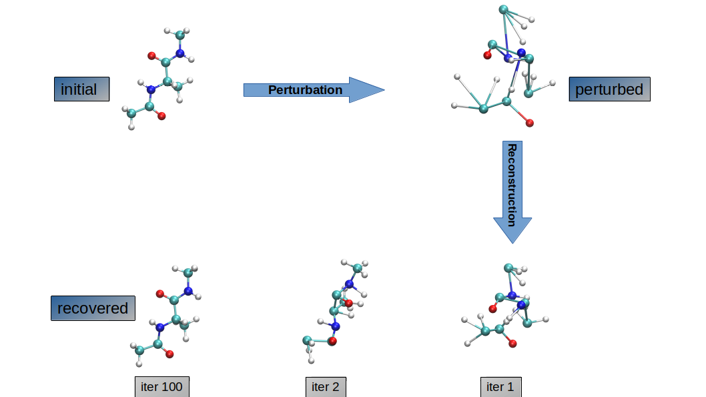

Microstate Sparse Reconstruction
================================
Microstate sparse reconstruction (MSR) is a backmapping algorithm that recovers all-atom structures from coarse-grained/reduced variables. MSR uses topological information (connectivity) of a given macromolecule and methods from optimization and inverse theory to rapidly achieve this recovery. The method has also been shown to scale well for much larger systems such as an assembly of proteins.

The schematic below shows how MSR can be used to reconstruct a physically meaningful structure of a strongly perturbed alanine dipeptide. 
<p style="text-align:center;"></p>

Authors
=======
Andrew Abi-Mansour and Peter Ortoleva
Department of Chemistry, Indiana University, Bloomington

**Please consider citing the following paper if your find this code useful in your research:**

[](https://doi.org/10.1021/acs.jctc.6b00348)

Prerequisites
=============
The 2 core requirements are: 
* PETSc - https://www.mcs.anl.gov/petsc
* OpenMPI - http://www.open-mpi.org or MPICH  - https://www.mpich.org

If you want to use the python API, you must install:
* MDAnalysis - https://code.google.com/p/mdanalysis
* Numpy - http://www.numpy.org

Python API
==========
Run ```make python``` to compile MSR as a library with a python API. 
A sample script (swm_example.py) is provided in the examples directory on how to use the python API.


C++ CLI
========

If you prefer compiling MSR as an executable, simply run ```make``` to generate a static executable (MSR.a) with the following CLI:

* --ref: path to input reference all-atom coordinates
* --indices: path to input bond/angle indices
* --lengths: path to input bond/angle lengths
* --cg: path to input CG coordinates
* --cgOP: path to the coarse-graining operator (matrix of size natoms x ncg) file
* [--out]: output filename of recovered all-atom positions
* [--tol]: tolerance set for the atomic displacement, below which convergence is assumed to be achieved, defaults to 0.1A
* [--maxiter]: max number of iterations the solver performs before giving up, defaults to 100

Feedback
========
Email me: andrew [at] gmail [dot] com
